# Breaking out of the Plateau
Median of 10 trials starting from the saturated corpus, plots include 95% confidence interval.

 - LibAFL 
 - StorFuzz 
 - DDFuzz 

## bloaty_fuzz_target
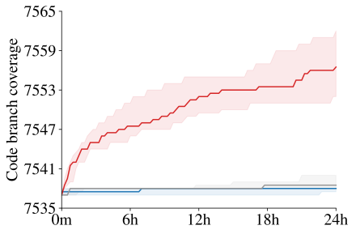

## curl_curl_fuzzer_http
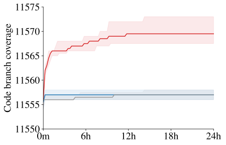

## freetype2_ftfuzzer
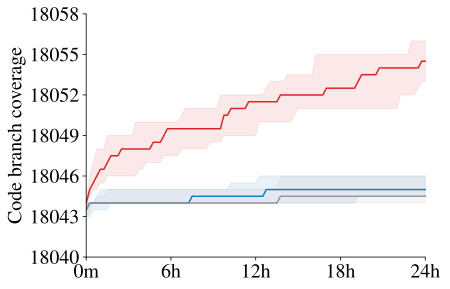

## harfbuzz_hb-shape-fuzzer

## jsoncpp_jsoncpp_fuzzer
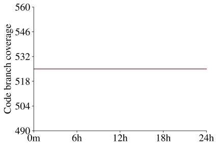

## lcms_cms_transform_fuzzer
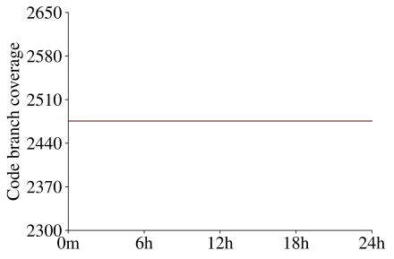

## libjpeg-turbo_libjpeg_turbo_fuzzer
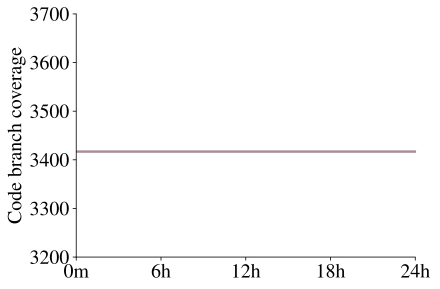

## libpcap_fuzz_both
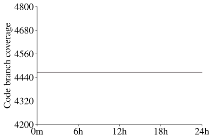

## libpng_libpng_read_fuzzer
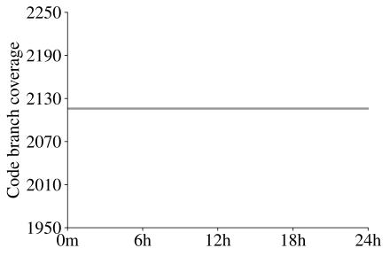

## libxml2_xml
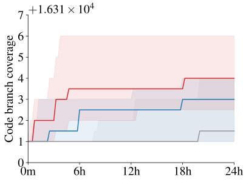

## libxslt_xpath
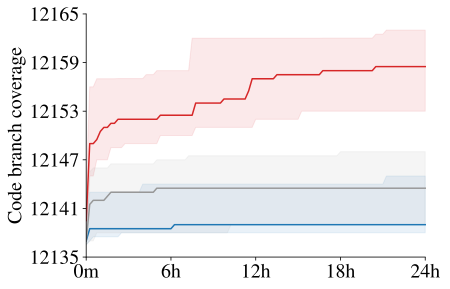

## mbedtls_fuzz_dtlsclient
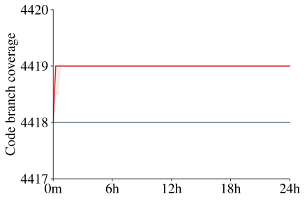

## openh264_decoder_fuzzer
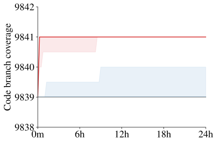

## openssl_x509
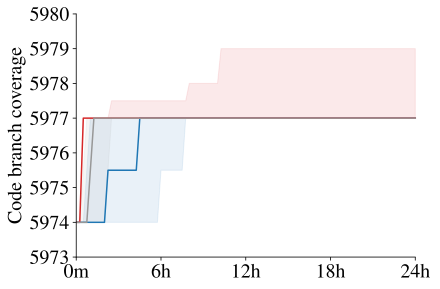

## openthread_ot-ip6-send-fuzzer
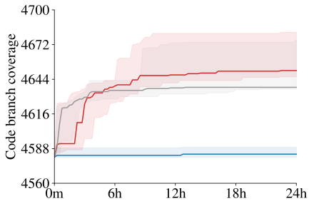

## proj4_proj_crs_to_crs_fuzzer
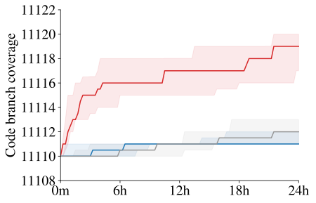

## re2_fuzzer
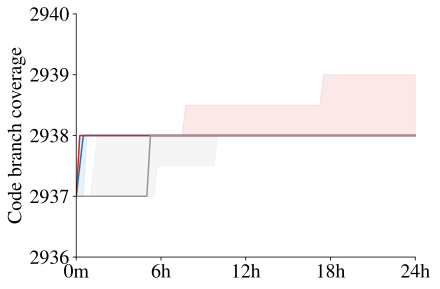

## sqlite3_ossfuzz
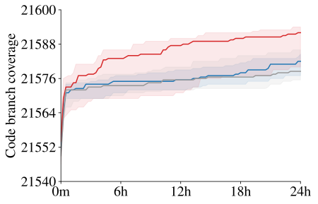

## stb_stbi_read_fuzzer

## systemd_fuzz-link-parser
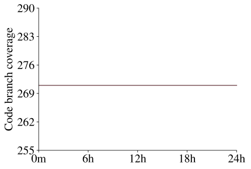

## vorbis_decode_fuzzer
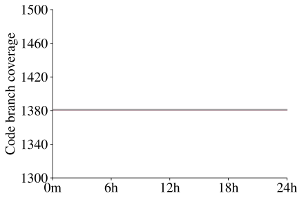

## woff2_convert_woff2ttf_fuzzer
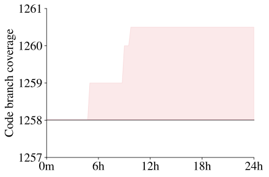

## zlib_zlib_uncompress_fuzzer
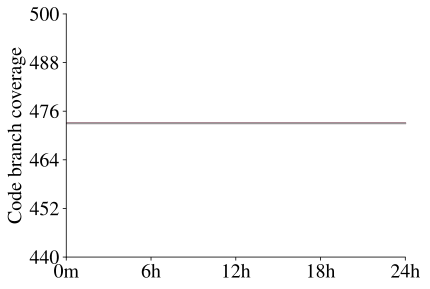

